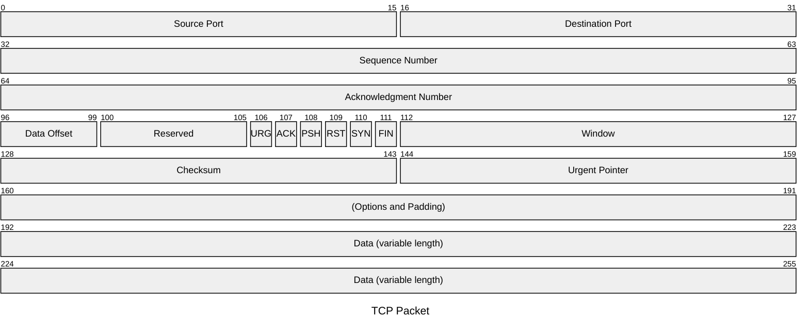
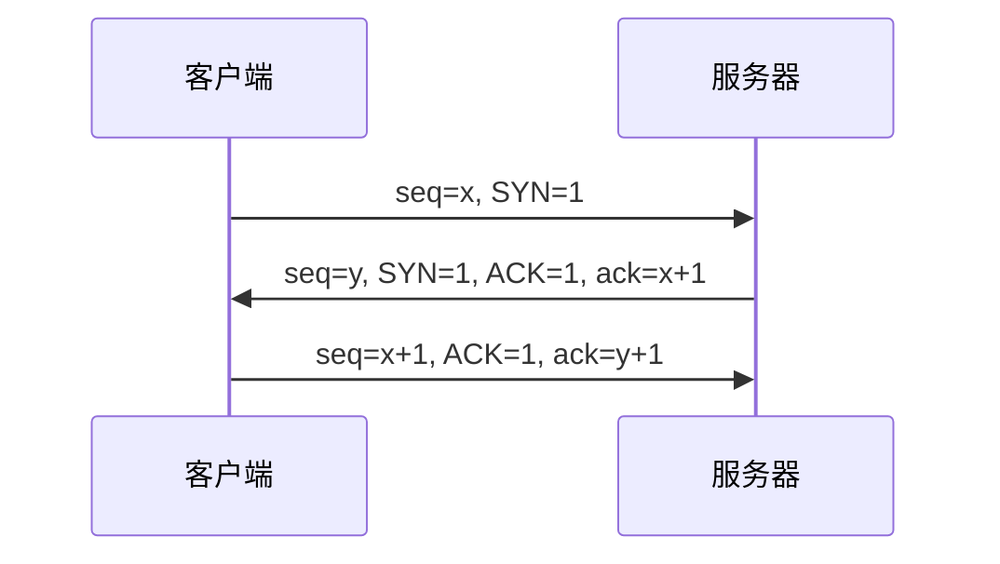

# TCP

- [TCP](#tcp)
  - [数据包图](#数据包图)
  - [三次握手](#三次握手)

## 数据包图

## 三次握手

> 过程

- 开始前
  - 服务端 CLOSED
  - 客户端 CLOSED
  - 服务端创建 TCB(传输控制块), 准备接收客户端请求, 进入 LISTEN 监听状态
- 第一次
  - 客户端创建 TCB
  - 客户端向服务端发送连接请求报文
  - ISN=x, SYN=1
  - ISN(Initial Sequence Number)初始序列号, 客户端和服务器各自随机生成的序列号, 同 seq
  - 客户端进入 SYN-SENT 同步已发送状态
  - 证明客户端的发送能力正常
- 第二次
  - 服务器收到请求报文
  - 服务端向客户端发出确认报文(若同意连接)
  - ISN=y, SYN=1, ACK=1, ack=x+1
  - 服务端进入 SYN-RCVD 同步收到状态
  - 证明服务器端的接收能力、发送能力正常
- 第三次
  - 客户端收到确认, 向服务器给出确认报文
  - seq=x+1, ACK=1, ack=y+1
  - 客户端进入 ESTABLISHED 已建立连接状态
  - 证明客户端的接收能力正常
- 服务端收到确认报文, 进入 ESTABLISHED 已建立连接状态

> 好处

- 建立可靠连接
- 同步序列号
- 防止已失效的连接请求
- 避免资源浪费
- 防止连接请求洪泛攻击
- 允许双方初始化序列号
- 提供流量控制的起点
